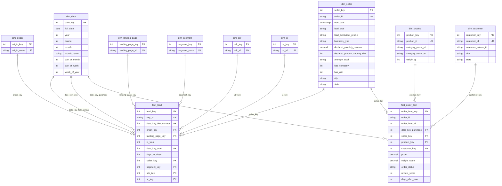

# Olist Marketing Funnel & E-Commerce Star Schema Architecture

> **Data Warehouse Schema**: `dw`  
> **Grain Architecture**: Dual Fact Tables linked via Conformed Dimensions  

---

## 1. Entity-Relationship Diagram (ERD)

---

## 2. Table Grain & Business Logic Summary

### Fact Tables
1. **`fact_lead`**: 
   - **Grain**: One row per Marketing Qualified Lead (`mql_id`).
   - **Surrogate Key**: `lead_key`.
   - **Metrics**: `is_won` (0/1), `days_to_close` (won_date minus first_contact_date).
   - **Null Handling**: Missing origin explicitly converted to `'unknown'`. Unwon leads have `date_key_won = NULL` and `days_to_close = NULL`.

2. **`fact_order_item`**:
   - **Grain**: One row per individual order line item (`order_id`, `order_item_id`).
   - **Surrogate Key**: `order_item_key`.
   - **Metrics**: `price`, `freight_value`, `review_score`, `days_after_won` (order purchase timestamp minus seller won_date).
   - **Filter Logic**: Restricts post-signing performance calculations to `days_after_won >= 0`.

### Dimension Tables
- **`dim_date`**: Conformed date dimension spanning 2017 to 2019. Key format: `YYYYMMDD`.
- **`dim_origin`**: Marketing acquisition channels (`paid_search`, `organic_search`, `referral`, `email`, `social`, `direct_traffic`, `organic_social`, `display`, `other`, `unknown`).
- **`dim_seller`**: Conformed dimension containing firmographic and onboarding profiles (`lead_type`, `lead_behaviour_profile`, `declared_monthly_revenue`, catalog size).
- **`dim_segment`, `dim_sdr`, `dim_sr`, `dim_product`, `dim_customer`**: Conformed lookup dimensions.
